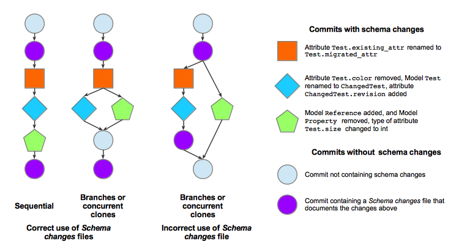

.. include:: <isonum.txt>

Data migration
==============

Migration overview
---------------------
Consider some data whose structure (data model) is defined by a schema. For example,
the structure of an SQL database is defined by a schema written in the SQL
Data Definition Language. When the schema is changed then existing data must be changed so that its structure still complies with the schema. This is called data *migration*. 
Many systems, including databases and web software frameworks provide tools that automate data migration.

Packages that use Object model (:obj:`obj_model`) store data in Excel, csv or tsv files. The structure of
the data in a file is defined by a schema that uses :obj:`obj_model`. The Object model *migration* module enables semi-automated migration of these data files.

This page provides an overview of the concepts of Object model migration and detailed instructions on how to configure and use it.

Migration concepts
----------------------------------------------
Object model migration avoids the tedious and error-prone manual effort that's required when a schema is changed
and multiple, large data files which use the schema to define their data models must be migrated.

Migration assumes that data files which are migrated and the schemas that define their data models
are stored in Git repositories. The repository storing the data files is called the *data repo*
while the repository containing the schema is the *schema repo*.
While these are typically distinct repositories, migration also supports the situation in which
one repository serves as both the *data repo* and the *schema repo*.

.. _figure_repos:
.. figure:: migration/figures/schema_and_data_repos.png
    :width: 600
    :align: left
    :alt: Schema and data repos

    Dependencies among Git repositories involved in data migration.
    The *schema repo* uses :obj:`obj_model` to define a schema. The *data repo* stores data files
    that use the schema repo to define their data model.

Migration further assumes that a schema is stored in a single Python file called
the *schema* file, and its name doesn't change over the time span of a migration.
Because it's stored in a Git repository, its versions are
recorded in a directed acyclic graph (DAG) of commits in the repository. These commits are
used by migration to determine changes in the *schema*.
Figure :numref:`figure_example_data_file_migration` below illustrates these concepts.

.. _figure_example_data_file_migration:
.. figure:: migration/figures/migration_example_figure.png
    :width: 600
    :alt: Example data file migration

    Example migration of file :obj:`biomodel_x.xlsx`.
    Three Git repositories are involved: :obj:`obj_model`, :obj:`wc_lang`, and :obj:`biomodel_x`.
    Time increases up the page, and within any repository later commits depend on earlier ones.
    :obj:`wc_lang` is a schema repo that is used by the data repo :obj:`biomodel_x`.
    The earliest illustrated commit of :obj:`biomodel_x` contains a version of :obj:`biomodel_x.xlsx` that depends on
    the earliest commit of :obj:`wc_lang`, as indicated by the dashed arrows.
    Two commits update :obj:`wc_lang`. Assuming that these commits modify :obj:`wc_lang`\ 's data model,
    :obj:`biomodel_x.xlsx` must be migrated. The migration automatically
    makes :obj:`biomodel_x.xlsx` consistent with the latest commit of :obj:`wc_lang` (solid purple arrow).

.. todo: perhaps distinguish schema & data repos by color
.. todo: use a better term than 'Object model'

Many types of changes can be applied to a schema:

* Add a :obj:`obj_model.core.Model` (henceforth, *Model*) definition
* Remove a *Model* definition
* Rename a *Model* definition
* Add an attribute to a *Model*
* Remove an attribute from a *Model*
* Rename an attribute of a *Model*
* Apply another type of changes to a *Model*

Migration automatically handles all types of changes except the last one, as illustrated in Figure
:numref:`figure_types_of_schema_changes`.
Adding and removing *Model* definitions and adding and removing attributes from *Model*\ s are
migrated completely automatically. Renaming *Model* definitions and attributes of *Model*\ s requires
configuration information from a user, as described below.

Other types of modifications can be automated by custom Python transformation programs,
which are also described below.

.. _figure_types_of_schema_changes:
.. figure:: migration/figures/types_of_schema_changes.png
    :width: 500
    :alt: Types of schema changes

    Types of schema changes.
    Additions and deletions to a schema are handled automatically by migration.
    Renaming *Model*\ s or attributes must be annotated in a Schema changes file.
    Modifications must be handled in a Python transformations module.

This code contains an example schema before migration, which we call the *existing* schema:

.. literalinclude:: ./migration/existing_schema.py
  :language: Python

And this example shows a *changed* version of the schema above, with comments that document the changes:

.. literalinclude:: ./migration/changed_schema.py
  :language: Python

The discussion below uses these examples.

Configuring migration
----------------------------------------------

To make migration easier and more reliable the durable state used by migration
in *schema repo*\ s and *data repo*\ s is recorded in configuration files.
*Schema repo*\ s contain three types of configuration files (Table 1):

* *Schema changes* files document some changes to a schema that cannot be determined automatically, in particular renaming of *Model*\ s and of *Model* attributes.
* A *transformations* file defines a Python class that performs user-customized transformations on *Model*\ s during migration.
* A :obj:`custom_io_classes.py` file in a *schema repo* gives migration handles to the schema's :obj:`Reader` and/or :obj:`Writer` classes so they can be used to read and/or write data files that use the schema.

Since committed changes in a repository are permanent, the schema changes and transformations
files provide permanent documentation of these changes for all migrations over
the changes they document.

*Data repo*\ s contain just one type of configuration file (Table 2):

.. todo: use table auto references for the tables

* A *data-schema migration configuration* file details the migration of a set of data files in the data repo.

Tables 1 and 2 below describe these user-customized configuration files and
code fragments in greater detail.
CLI commands create templates of some of these files.

.. todo: which commands & files? make a table of that, perhaps

.. csv-table:: Configuration files in schema repos
   :file: ./migration/migrations_rst_tables_schema_repo_config.csv
   :widths: 12, 25, 25, 25, 4
   :header-rows: 1

.. csv-table:: Configuration file in data repos
   :file: migration/migrations_rst_tables_data_repo_config.csv
   :widths: 20, 80

Example configuration files
^^^^^^^^^^^^^^^^^^^^^^^^^^^

This section presents examples of migration configuration files and
code fragments that would be used to migrate data files
from the *existing* schema to the *changed* schema above.

This example *Schema changes* file documents the changes between the *existing* and *changed*
schema versions above:

.. literalinclude:: migration/schema_changes_2019-03-26-20-16-45_820a5d1.yaml
  :language: YAML

All schema changes files contain these fields:
:obj:`commit_hash`, :obj:`renamed_models`, :obj:`renamed_attributes`, and :obj:`transformations_file`.

* :obj:`commit_hash` is the hash of the git commit which the Schema changes file annotates -- it is the last commit in the DAG of commits containing the changes that the Schema changes file documents. That is, as illustrated in Figure :numref:`figure_commit_dependencies`, the commit identified in the *Schema changes* file must depend on all commits that modified the schema since the commit identified by the previous *Schema changes* file.

* :obj:`renamed_models` is a YAML list that documents all *Model*\ s in the schema that were renamed. Each renaming is given as a pair of the form :obj:`[ExistingName, ChangedName]`.

* :obj:`renamed_attributes` is a YAML list that documents all attributes in the schema that were renamed. Each renaming is given as a pair in the form :obj:`[[ExistingModelName, ExistingAttrName], [ChangedModelName, ChangedAttrName]]`.  If the *Model* name hasn't changed, then :obj:`ExistingModelName` and :obj:`ChangedModelName` will be the same. :obj:`transformations_file` optionally documents the name of a Python file that contains a class which performs custom transformations on all *Model* instances as they are migrated.

.. _figure_commit_dependencies:

    Dependency graph of Git commits that change a schema and the schema changes files that describe them.
    These graphs illustrate networks in which nodes are commits, and directed edges point
    from a parent commit to a child commit that depends on it.
    The :obj:`commit_hash` in each Schema changes file is the Git hash of its parent commit
    (although a Schema changes file may describe a DAG of commits further back in the dependency graph).
    The legend shows 3 colored commits that contain the changes made between the
    *existing* to *changed* versions of the schema above.
    The orange commit must be upstream from the blue commit because
    the orange commit accesses *Model* :obj:`Test` and
    the blue commit renames *Model* :obj:`Test` to *Model* :obj:`ChangedTest`.
    The two commit histories in the **Correct use of *Schema changes* files** section
    show proper use of Schema changes files.
    In the **Sequential** history the last commit containing a Schema changes file is properly downstream from
    all commits changing the schema.
    In the **Branches or concurrent clones** history, the final
    commit containing a Schema changes file is also properly downstream from the commits changing the schema.
    However, in the **Incorrect use of Schema changes file** section, the final
    commit containing a Schema changes file is incorrectly placed because it is not downstream from
    the green commit. Migration of a data file with this history would fail.

.. todo: perhaps use a different icon for the second (last) schema changes commit in each commit history

Template schema changes files are generated by the CLI command :obj:`make-changes-template`, as described below.

This example *transformations* file contains a class that
converts the floats in attribute :obj:`Test.size` into ints:

.. literalinclude:: migration/example_transformation.py
  :language: Python

Transformations are subclasses of :obj:`obj_model.migrate.MigrationWrapper`. `Model` instances can
be converted before or after migration, or both. 
The :obj:`prepare_existing_models` method converts models before migration, while 
:obj:`modify_migrated_models` converts them after migration. Both methods have the same signature.
The :obj:`migrator` argument provides an instance of :obj:`obj_model.migrate.Migrator`, the class
that performs migration. Its attributes provide information about the migration. E.g., this
code uses :obj:`migrator.existing_defs` which is a dictionary that maps each *Model*'s name
to its class definition to obtain the definition of the :obj:`Test` class.

.. todo: carefully distinguish between a Schema changes file, commits that create or modify it, and commits that it describes

This example :obj:`custom_io_classes.py` file configures a migration of files that
use the :obj:`wc_lang` schema to use the :obj:`wc_lang.io.Reader`:

.. literalinclude:: migration/custom_io_classes.py
  :language: Python

In general, a :obj:`custom_io_classes.py` file will be needed if the *schema repo* defines its
own :obj:`Reader` or  :obj:`Writer` classes for data file IO.

This example *data-schema migration configuration* file configures the migration of one file,
:obj:`data_file_1.xlsx`.

.. literalinclude:: migration/data_schema_migration_conf-migration_test_repo.yaml
  :language: YAML

All data-schema migration config files contain four fields:

* :obj:`files_to_migrate` contains a list of paths to files in the data repo that will be migrated
* :obj:`schema_repo_url` contains the URL of the schema repo
* :obj:`branch` contains the schema repo's branch
* :obj:`schema_file` contains the path to the schema file in the schema repo relative to its URL

A data-schema migration configuration can be fully initialized by
the :obj:`make-data-schema-migration-config-file` CLI command.

Schema git metadata in data files
^^^^^^^^^^^^^^^^^^^^^^^^^^^^^^^^

Each data file in the *data repo* must contain a *Model* that documents the version of the *schema repo*
upon which the file depends. This git metadata is stored in a *SchemaRepoMetadata* *Model*
(which will be in a *Schema repo metadata* worksheet in an Excel file). The metadata specifies the schema's
version with its URL, branch, and commit hash. 
A migration of the data file will start at the specified commit in the *schema repo*. An example
Schema repo metadata worksheet in an Excel file is illustrated below:

.. figure:: migration/figures/schema_git_metadata.png
    :width: 400
    :alt: Example Schema repo metadata worksheet in an Excel data file

    Example Schema repo metadata worksheet in an Excel data file.
    This schema repo metadata provides the point in the schema's commit history 
    at which migration of the data file would start.

Migration migrates a data file from the schema commit identified in the file's schema's git metadata to
the last *schema changes* configuration file in the *schema repo*.

Topological sort of schema changes
------------------------------------
Migration of a data file executes this algorithm:

.. code-block:: python

    def migrate_file(existing_filename, migrated_filename, schema_repo):
        """ Migrate the models in `existing_filename` according to the
            schema changes in `schema_repo`, and write the results in `migrated_filename`.
        """

        # get_schema_commit() reads the Schema repo metadata in the data file
        starting_commit = get_schema_commit(existing_filename)
        schema_changes = schema_repo.get_dependent_schema_changes(starting_commit)

        # topological_sort() returns a topological sort based on the schema repo's commit DAG
        ordered_schema_changes = schema_repo.topological_sort(schema_changes)
        existing_models = read_file(filename)
        existing_schema = get_schema(starting_commit)

        for schema_change in ordered_schema_changes:
            end_commit = schema_change.get_commit()
            migrated_schema = get_schema(end_commit)
            # migrate() migrates existing_models from the existing_schema to the migrated_schema
            migrated_models = migrate(existing_models, existing_schema, migrated_schema)
            existing_models = migrated_models
            existing_schema = migrated_schema

        write_file(migrated_filename, migrated_models)

A `topological sort <https://en.wikipedia.org/wiki/Topological_sorting>`_ of a DAG finds a
sequence of nodes in the DAG such that if node X transitively depends on node Y in the DAG then X appears after Y in the sequence.
Topological sorts are non-deterministic because node pairs that have no transitive
dependency relationship in the DAG can appear in any order in the sequence.
For example, a DAG with the edges A |rarr| B |rarr| D, A |rarr| C |rarr| D, can be topologically sorted to
either A |rarr| B |rarr| C |rarr| D or  A |rarr| C |rarr| B |rarr| D.

Schema changes files must therefore annotate commits in the schema repo's commit dependency graph such that
*any* topological sort of them produces a legal migration.
We illustrate incorrect and correct placement of Schema changes files in Figure :numref:`figure_schema_changes_topological_sort`.

.. _figure_schema_changes_topological_sort:
.. figure:: migration/figures/schema_changes_topological_sort.png
    :width: 400
    :alt: Placement of schema changes commits in a Git history

    Placement of schema changes commits in a Git history (this figure reuses the legend in
    Figure :numref:`figure_commit_dependencies`).
    Migration topologically sorts the commits annotated by the schema changes files (indicated by thick outlines).
    In **A**, since the blue diamond commit and green pentagon commit have no dependency relationship in the
    Git commit DAG, they can be sorted in either order.
    This non-determinism is problematic for a migration that uses the commit history in **A**:
    if the diamond commit is sorted before the pentagon commit,
    then migration to the pentagon commit will fail because it accesses *Model* :obj:`Test` which
    will no longer exist because migration to the diamond commit renames :obj:`Test` to :obj:`ChangedTest`.
    No non-determinism exists in **B** because the commits annotated by the schema changes files -- x and y --
    are related by x |rarr| y in the Git commit DAG. A migration of **B** will not have the problem in
    **A** because the existing *Models*\ s that get accessed by the transformation
    above will succeed because it uses the schema
    defined by the top commit.

.. todo: use labeled nodes in figure schema_changes_topological_sort

Using migration
----------------------------------------------
Migration commands are run via the wholecell command line interface program :obj:`wc-cli` program on the command line.
Different commands are available for *schema repo*\ s and *data repo*\ s.

Schema repo migration commands
^^^^^^^^^^^^^^^^^^^^^^^^^^^^^^

:obj:`wc_lang` (abbreviated `lang`) is a schema repo. All schema repos will support this command.

The :obj:`make-changes-template` command creates a template *Schema changes* file.
By default, it creates a *Schema changes* template in the schema repo that contains the current directory.
To use another schema repo, specify a directory in it with the :obj:`--schema_repo_dir` option.

By default, the *Schema changes* template created references the most recent commit in the schema repo.
To have the *Schema changes* file reference another commit, provide its
hash with the :obj:`--commit` option.
This makes it easy to add a schema changes file that references a commit after 
making other commits downstream from the referenced commit.

:obj:`make-changes-template` populates the value of the :obj:`commit_hash` field in the template
created. The hash's prefix also appears in the file's name.
The format of the fields :obj:`renamed_models`, :obj:`renamed_attributes`, and
:obj:`transformations_file` is written, but their data must be entered by hand.

.. code-block:: none

    usage: wc-cli tool lang make-changes-template [-h]
                                       [--schema_repo_dir SCHEMA_REPO_DIR]
                                       [--commit COMMIT]

    Create a template schema changes file

    optional arguments:
      --schema_repo_dir SCHEMA_REPO_DIR
                        path of the directory of the schema's repository;
                        defaults to the current directory
      --commit COMMIT   hash of a commit containing the changes; default is
                        most recent commit

Data repo migration commands
^^^^^^^^^^^^^^^^^^^^^^^^^^^^

:obj:`wc_sim` (abbreviated `sim`) is a data repo. All data repos will support the same commands.

The :obj:`make-data-schema-migration-config-file` command
creates a data-schema migration configuration file. It must be given the full URL of the
Python schema file in its Git repository, including its branch. For example
:obj:`https://github.com/KarrLab/wc_lang/blob/master/wc_lang/core.py` is the URL of the
schema in :obj:`wc_lang`.
It must also be given the absolute or relative path to at least one data file that
will be migrated by when the data-schema migration config file is used. The config file
can always be edited to add, remove or changes data files.

By default, :obj:`make-data-schema-migration-config-file` assumes that the current directory
is contained in the data repo that will be configured in the new migration config file.
A different data repo can be specified by using the :obj:`--data_repo_dir` option.

.. code-block:: none

    usage: wc-cli tool sim make-data-schema-migration-config-file
           [-h] [--data_repo_dir DATA_REPO_DIR]
           schema_url file_to_migrate [file_to_migrate ...]

    Create a data-schema migration configuration file

    positional arguments:
      schema_url        URL of the schema in its git repository,
                        including the branch
      file_to_migrate   a file to migrate

    optional arguments:
      --data_repo_dir DATA_REPO_DIR
                        path of the directory of the repository storing the
                        data file(s) to migrate; defaults to the current
                        directory

The :obj:`do-configured-migration` command migrates the data files specified in
a data-schema migration config file. 

.. todo: clarify where the migrated files go

.. code-block:: none

    usage: wc-cli tool sim do-configured-migration [-h] migration_config_file

    Migrate data file(s) as configured in a data-schema migration
    configuration file

    positional arguments:
      migration_config_file
                    name of the data-schema migration configuration file to use

The :obj:`migrate-data` command migrates specified data file(s).
Like :obj:`make-data-schema-migration-config-file`, it must be given the full URL of the
Python schema file in its Git repository, including its branch, and
the absolute or relative path to at least one data file to migrate.
By default, :obj:`migrate-data` assumes that the current directory
is contained in the data repo that contains the data files to migrate.
A different data repo can be specified by using the :obj:`--data_repo_dir` option.

.. todo: clarify where the migrated files go

.. code-block:: none

    usage: wc-cli tool sim migrate-data [-h] [--data_repo_dir DATA_REPO_DIR]
                                    schema_url file_to_migrate
                                    [file_to_migrate ...]

    Migrate specified data file(s)

    positional arguments:
      schema_url        URL of the schema in its git repository,
                        including the branch
      file_to_migrate   a file to migrate

    optional arguments:
      --data_repo_dir DATA_REPO_DIR
                        path of the directory of the repository storing the
                        data file(s) to migrate; defaults to the current
                        directory

Practical considerations
^^^^^^^^^^^^^^^^^^^^^^^^

The user must be able to clone the data repo and schema repo.

Limitations
----------------------------------------------

As of August 2019 the implementation of migration has these limitation:

* Migration requires that schemas and data files be stored in Git repositories -- no other version control systems are supported.
* The schema must be stored in a repository. This will may not be convenient for modelers who use a schema written by other people and simply install it as a Python package.
* Migration of large data files runs slowly.

.. todo: quantify this
