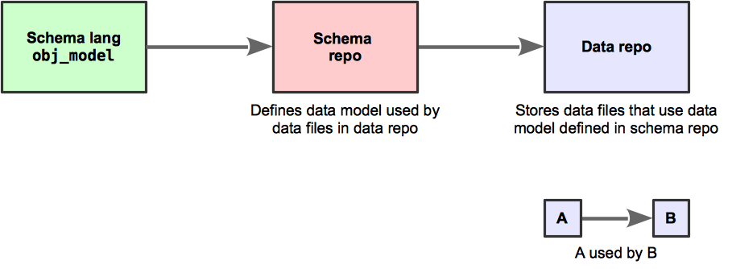
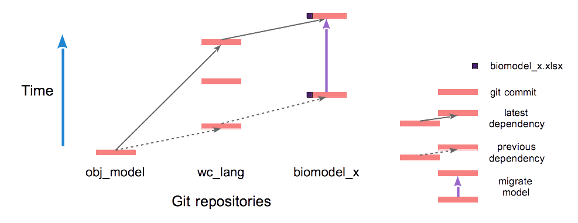
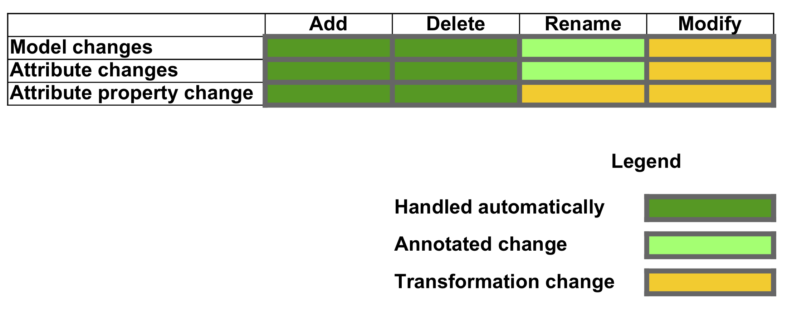
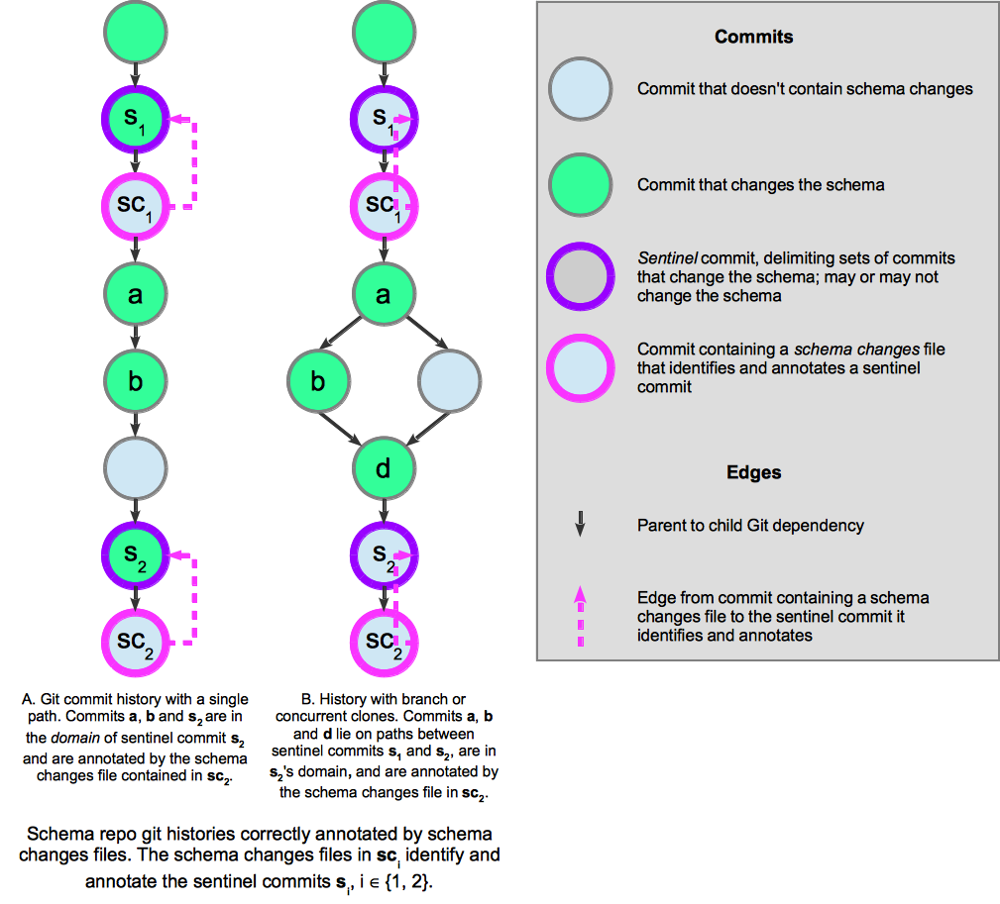
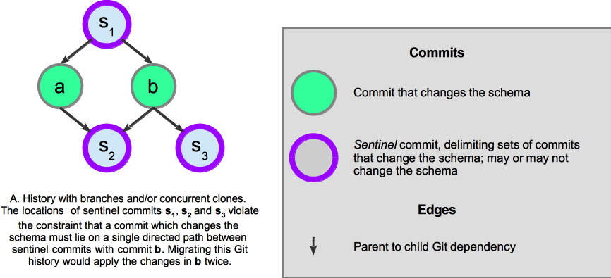
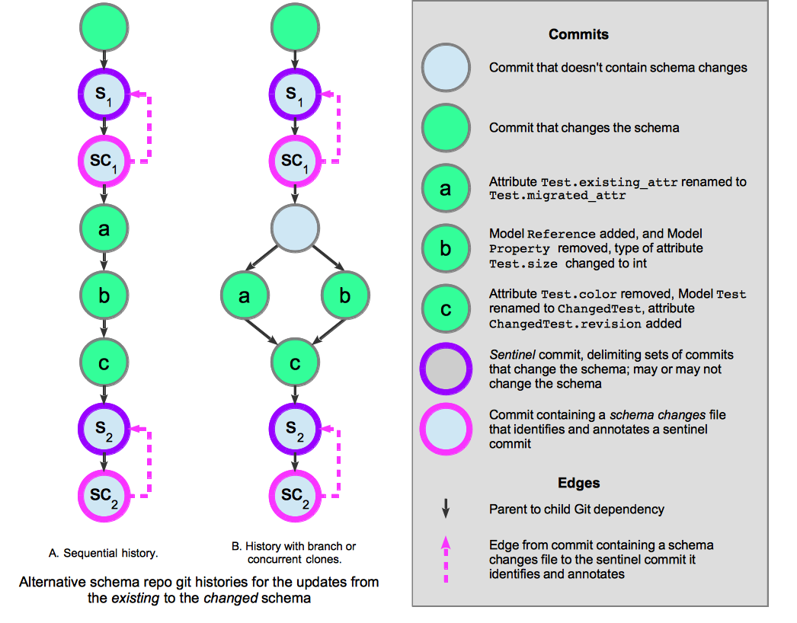
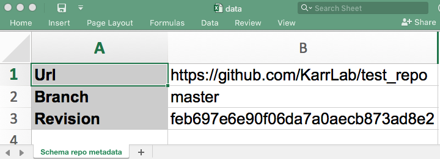
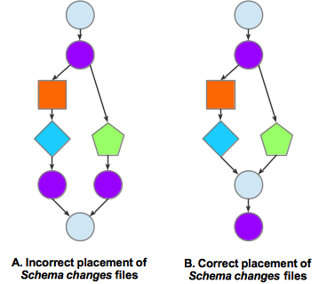

.. |rarr|   unicode:: U+02192 .. RIGHTWARDS ARROW

Data migration
==============

Migration overview
---------------------
Consider some data whose structure (also known as its *data model*) is defined by a schema written in a data definition language.
For example, the structure of an SQL database is defined by a schema written in
`SQL's Structured query language <https://en.wikipedia.org/wiki/Data_definition_language#Structured_Query_Language_(SQL)>`_.

When a schema is updated then existing data must be changed so that its structure complies with the updated schema. This is called *data migration*. 
Many systems, including database systems and web software frameworks, provide tools that automate data migration
so that users can avoid the tedious and error-prone manual effort that's usually required when a schema is changed
and large amounts of data must be migrated.

Packages that use Object model (:obj:`obj_tables`) store data in Excel, csv or tsv files. The structure of
the data in a file is defined by a schema that uses :obj:`obj_tables`. Object model *migration* enables automated
migration of these data files.

This page explains the concepts of Object model migration and provides detailed instructions on how to configure and use it.

Migration concepts
----------------------------------------------
Object model migration automates the process of migrating data files that use a schema which has been updated.

Migration assumes that data files which are migrated and the schemas that define their data models
are stored in Git repositories. The repository storing the data files is called the *data repo*
while the repository containing the schema is the *schema repo*.
While these are typically two distinct repositories, migration also supports the situation in which
one repository is both the *data repo* and the *schema repo*.

.. _figure_schema_and_data_repos:

    Dependencies among Git repositories involved in data migration.
    The *schema repo* uses :obj:`obj_tables` to define a schema. The *data repo* stores data files
    that use the data model defined in the schema repo.

Migration further assumes that the schema defined in a schema repo is stored in a single Python file,
which is called the *schema* file.
Because it's stored in a Git repository, the schema file's version history is
recorded in the schema repo's commits, which are used by migration.
:numref:`figure_example_data_file_migration` below illustrates these concepts.

.. todo: bigger text in figure
.. todo: distinguish schema & data repos by color, using the same colors as in schema_and_data_repos.png

.. _figure_example_data_file_migration:

    Example migration of file :obj:`biomodel_x.xlsx`.
    Three Git repositories are involved: :obj:`obj_tables`, :obj:`wc_lang`, and :obj:`biomodel_x`.
    Time increases upward, and within any repository later commits depend on earlier ones.
    :obj:`wc_lang` is a schema repo that defines the data model for files stored in the data repo :obj:`biomodel_x`.
    The earliest illustrated commit of :obj:`biomodel_x` contains a version of :obj:`biomodel_x.xlsx` that depends on
    the earliest commit of :obj:`wc_lang`, as indicated by the dashed arrow.
    Two commits update :obj:`wc_lang`. If these commits modify :obj:`wc_lang`\ 's schema,
    then :obj:`biomodel_x.xlsx` must be migrated. The migration (solid purple arrow) automatically
    makes the data in :obj:`biomodel_x.xlsx` consistent with the latest commit of :obj:`wc_lang`.

We decompose the ways in which a schema can be changed into these categories:

* Add a :obj:`obj_tables.core.Model` (henceforth, *Model*) definition
* Remove a *Model* definition
* Rename a *Model* definition
* Add an attribute to a *Model*
* Remove an attribute from a *Model*
* Rename an attribute of a *Model*
* Apply another type of changes to a *Model*

Migration automatically handles all of these change categories except the last one, as illustrated in
:numref:`figure_types_of_schema_changes`.
Adding and removing *Model* definitions and adding and removing attributes from *Model*\ s are
migrated completely automatically. If the names of *Model*\ s or the names of *Model* attributes
are changed, then configuration information must be manually supplied because the relationship
between the initial and final names cannot be determined automatically when multiple names are changed.
Other types of modifications can be automated by custom Python transformation programs,
which are described below.

.. _figure_types_of_schema_changes:

    Types of schema changes.
    Changes that add or delete *Model*\ s or *Model* attributes are handled automatically by migration.
    Changing the name of a *Model*\ s or attributes must be annotated in a manually edited configuration file.
    Changes that do not fall into these categories must be handled by a custom Python transformations module
    that processes each *Model* as it is migrated.

The code below contains a schema that's defined using Object model.
This documentation employs it as the schema for an example data file before migration, and
refers to it as the *existing* schema:

.. literalinclude:: ./migration/existing_schema.py
  :language: Python

This example shows a changed version of the *existing* schema above, and we refer to it as the *changed* schema:

.. todo: change 'changed' to 'migrated' above, and throughout this page

.. literalinclude:: ./migration/changed_schema.py
  :language: Python

Configuring migration
---------------------

To make migration easier and more reliable the durable state used by migration
in *schema repo*\ s and *data repo*\ s is recorded in configuration files.

Sentinel commits
^^^^^^^^^^^^^^^^
To organize the changes in a schema repo into manageable groups,
migration identifies *sentinel* commits that delimit
sets of commits that change the schema.
Considering the repo's commit dependency graph,
sentinel commits must be located in the graph so that
each commit which changes the schema depends on exactly one
upstream sentinel commit, and is an ancestor of exactly one downstream
sentinel commit (see :numref:`figure_schema_changes_and_sentinel_commits`).
In addition, a sentinel commit can have at most one ancestor sentinel commit that's reachable
without traversing another sentinel commit.
All the commits that are ancestors of a sentinel commit and depend upon the sentinel commit's
closest ancestor sentinel commit are members of the sentinel commit's *domain*.
In addition, a sentinel commit is a member of its own *domain*.
We use the term *domain* to describe both commits and the changes to the schema made by the commits.

Migration migrates a data file across a sequence of sentinel commits.

.. _figure_schema_changes_and_sentinel_commits:

    Sentinel commits in schema repo commit histories.
    Commits that do not change the schema may be present, but are not involved in migration.
    Each sentinel commit delimits the downstream boundary of a set of commits.
    In A, the changes in commits **a** and **b** will be applied to data being migrated from 
    sentinel s\ :sub:`1` to sentinel s\ :sub:`2`.
    B illustrates a Git history created by
    branching or concurrent clones, but the commits **a**, **b**, and **d**
    still depend on exactly one upstream sentinel commit, s\ :sub:`1`, and
    are ancestors of exactly one downstream sentinel commit, s\ :sub:`2`.

Sentinel commit configurations that violate the constraints in the first paragraph of this section
create Git histories that cannot be migrated.
For an example, see :numref:`figure_illegal_schema_changes_and_sentinel_commits_history`.

.. _figure_illegal_schema_changes_and_sentinel_commits_history:

    Sentinel commits in a schema repo commit history that cannot be migrated.
    
.. todo: label the constraints more precisely, and write more about figure illegal_schema_changes_and_sentinel_commits_history.png

Configuration files
^^^^^^^^^^^^^^^^^^^

*Schema repo*\ s contain three types of configuration files (:numref:`table_migrations_rst_tables_schema_repo_config`):

* A *schema changes* file identifies a sentinel commit, and annotates the changes to the schema in the sentinel commit's domain. Symmetrically, each sentinel commit must be identified by one schema changes file.
* A *transformations* file defines a Python class that performs user-customized transformations on *Model*\ s during migration.
* A :obj:`custom_io_classes.py` file in a *schema repo* gives migration handles to the schema's :obj:`Reader` and/or :obj:`Writer` classes so they can be used to read and/or write data files that use the schema.

Since committed changes in a repository are permanent, the schema changes and transformations
files provide permanent documentation of these changes for all migrations over
the changes they document.

*Data repo*\ s contain just one type of configuration file (:numref:`table_migrations_rst_tables_data_repo_config`):

* A *data-schema migration configuration* file details the migration of a set of data files in the data repo.

:numref:`table_migrations_rst_tables_schema_repo_config` and :numref:`table_migrations_rst_tables_data_repo_config`
describe these user-customized configuration files and code fragments in greater detail.

.. _table_migrations_rst_tables_schema_repo_config:
.. csv-table:: Configuration files in schema repos
   :file: ./migration/migrations_rst_tables_schema_repo_config.csv
   :widths: 12, 25, 25, 25, 4
   :header-rows: 1

.. _table_migrations_rst_tables_data_repo_config:
.. csv-table:: The configuration file in data repos
   :file: migration/migrations_rst_tables_data_repo_config.csv
   :widths: 20, 80

Example configuration files
^^^^^^^^^^^^^^^^^^^^^^^^^^^

This section presents examples of migration configuration files and
code fragments that would be used to migrate data files
from the *existing* schema to the *changed* schema above.

This example *Schema changes* file documents the changes between the *existing* and *changed*
schema versions above:

.. literalinclude:: migration/schema_changes_2019-03-26-20-16-45_820a5d1.yaml
  :language: YAML

All schema changes files contain these fields:
:obj:`commit_hash`, :obj:`renamed_models`, :obj:`renamed_attributes`, and :obj:`transformations_file`.

* :obj:`commit_hash` is the hash of the sentinel Git commit that the Schema changes file annotates. That is, as illustrated in :numref:`figure_annotated_history_of_updates_in_schema_example`, the commit identified in the *Schema changes* file must depend on all commits that modified the schema since the closest upstream sentinel commit.

* :obj:`renamed_models` is a YAML list that documents all *Model*\ s in the schema that were renamed. Each renaming is given as a pair of the form :obj:`[ExistingName, ChangedName]`.

* :obj:`renamed_attributes` is a YAML list that documents all attributes in the schema that were renamed. Each renaming is given as a pair in the form :obj:`[[ExistingModelName, ExistingAttrName], [ChangedModelName, ChangedAttrName]]`.  If the *Model* name hasn't changed, then :obj:`ExistingModelName` and :obj:`ChangedModelName` will be the same. :obj:`transformations_file` optionally documents the name of a Python file that contains a class which performs custom transformations on all *Model* instances as they are migrated.

.. _figure_annotated_history_of_updates_in_schema_example:

    Example schema changes for the updates from the *existing* to the *changed* schema above.
    This figure illustrates
    alternative Git histories of the schema changes and migration annotations that could occur
    when updating the schema repo to reflect the changes between the *existing* and the *changed* schemas above.

As shown in :numref:`figure_annotated_history_of_updates_in_schema_example`, by default,
a schema changes file identifies the head commit as the sentinel commit that it
annotates.
However, a schema changes file may identify a sentinel commit further back in the dependency graph.
The identification is implemented by storing the sentinel commit's hash in the schema changes file's
:obj:`commit_hash`.

The changes between the *existing* and the *changed* schemas are separated into three
commits, **a**, **b**, and **c**.
**a** and **b** must both occur before **c**, 
because **a** and **b** both access *Model* :obj:`Test` whereas
**c** renames *Model* :obj:`Test` to *Model* :obj:`ChangedTest`.
Both alternative commit histories both satisfy these constraints.

Template schema changes files are generated by the CLI command :obj:`make-changes-template`, as described below.

This example *transformations* file contains a class that
converts the floats in attribute :obj:`Test.size` into ints:

.. literalinclude:: migration/example_transformation.py
  :language: Python

Transformations are subclasses of :obj:`obj_tables.migrate.MigrationWrapper`. `Model` instances can
be converted before or after migration, or both. 
The :obj:`prepare_existing_models` method converts models before migration, while 
:obj:`modify_migrated_models` converts them after migration. Both methods have the same signature.
The :obj:`migrator` argument provides an instance of :obj:`obj_tables.migrate.Migrator`, the class
that performs migration. Its attributes provide information about the migration. E.g., this
code uses :obj:`migrator.existing_defs` which is a dictionary that maps each *Model*'s name
to its class definition to obtain the definition of the :obj:`Test` class.

This example :obj:`custom_io_classes.py` file configures a migration of files that
use the :obj:`wc_lang` schema to use the :obj:`wc_lang.io.Reader`:

.. literalinclude:: migration/custom_io_classes.py
  :language: Python

In general, a :obj:`custom_io_classes.py` file will be needed if the *schema repo* defines its
own :obj:`Reader` or  :obj:`Writer` classes for data file IO.

.. todo: then why doesn't the example define Writer?

This example *data-schema migration configuration* file configures the migration of one file,
:obj:`data_file_1.xlsx`.

.. literalinclude:: migration/data_schema_migration_conf-migration_test_repo.yaml
  :language: YAML

All data-schema migration config files contain four fields:

* :obj:`files_to_migrate` contains a list of paths to files in the data repo that will be migrated
* :obj:`schema_repo_url` contains the URL of the schema repo
* :obj:`branch` contains the schema repo's branch
* :obj:`schema_file` contains the path of the schema file in the schema repo relative to its URL

Migration commands create data-schema migration configuration and schema changes files, as listed
in :numref:`table_migrations_rst_tables_migration_commands` below.

Schema Git metadata in data files
^^^^^^^^^^^^^^^^^^^^^^^^^^^^^^^^^

Each data file in the *data repo* must contain a *Model* that documents the version of the *schema repo*
upon which the file depends. 
For migration to work properly this version must be a sentinel commit in the schema repo.
This Git metadata is stored in a *SchemaRepoMetadata* *Model*
(which will be in a *Schema repo metadata* worksheet in an Excel file). The metadata specifies the schema's
version with its URL, branch, and commit hash. 
A migration of the data file will start at the specified commit in the *schema repo*. An example
Schema repo metadata worksheet in an Excel file is illustrated below:

.. _figure_schema_git_metadata:

    Example Schema repo metadata worksheet in an Excel data file.
    This schema repo metadata provides the point in the schema's commit history 
    at which migration of the data file would start.

Migration migrates a data file from the schema commit identified in the file's schema's Git metadata to
the last sentinel commit in the *schema repo*.

Topological sort of schema changes
------------------------------------
The migration of a data file 
modifies data so that its structure is consistent with the schema changes saved in Git commits in the schema repo.
Because the dependencies between commits cannot be circular, the dependency graph of commits is a
directed acyclic graph (DAG).

Migration executes this algorithm:

.. code-block:: python

    def migrate_file(existing_filename, migrated_filename, schema_repo):
        """ Migrate the models in `existing_filename` according to the
            schema changes in `schema_repo`, and write the results in `migrated_filename`.
        """

        # get_schema_commit() reads the Schema repo metadata in the file,
        # and obtains the corresponding commit
        starting_commit = get_schema_commit(existing_filename)
        # obtain the schema changes that depend on `starting_commit`
        schema_changes = schema_repo.get_dependent_schema_changes(starting_commit)

        # topologically sort schema_changes using dependencies in the schema repo's commit DAG
        ordered_schema_changes = schema_repo.topological_sort(schema_changes)
        existing_models = read_file(filename)
        existing_schema = get_schema(starting_commit)

        # iterate over the topologically sorted schema changes
        for schema_change in ordered_schema_changes:
            end_commit = schema_change.get_commit()
            migrated_schema = get_schema(end_commit)
            # migrate() migrates existing_models from the existing_schema to the migrated_schema
            migrated_models = migrate(existing_models, existing_schema, migrated_schema)
            existing_models = migrated_models
            existing_schema = migrated_schema

        write_file(migrated_filename, migrated_models)

A `topological sort <https://en.wikipedia.org/wiki/Topological_sorting>`_ of a DAG finds a
sequence of nodes in the DAG such that if node X transitively depends on node Y in the DAG then X appears after Y in the sequence.
Topological sorts are non-deterministic because node pairs that have no transitive
dependency relationship in the DAG can appear in any order in the sequence.
For example, a DAG with the edges A |rarr| B |rarr| D, A |rarr| C |rarr| D, can be topologically sorted to
either A |rarr| B |rarr| C |rarr| D or  A |rarr| C |rarr| B |rarr| D.

Sentinel commits must must therefore be selected such that
*any* topological sort of them produces a legal migration.
We illustrate incorrect and correct placement of sentinel commits in :numref:`figure_schema_changes_topological_sort`.

.. _figure_schema_changes_topological_sort:

    Placement of schema changes commits in a Git history (this figure reuses the legend in
    :numref:`figure_annotated_history_of_updates_in_schema_example`).
    Migration topologically sorts the commits annotated by the schema changes files (indicated by thick outlines).
    In **A**, since the blue diamond commit and green pentagon commit have no dependency relationship in the
    Git commit DAG, they can be sorted in either order.
    This non-determinism is problematic for a migration that uses the commit history in **A**:
    if the diamond commit is sorted before the pentagon commit,
    then migration to the pentagon commit will fail because it accesses *Model* :obj:`Test` which
    will no longer exist because migration to the diamond commit renames :obj:`Test` to :obj:`ChangedTest`.
    No non-determinism exists in **B** because the commits annotated by the schema changes files -- x and y --
    are related by x |rarr| y in the Git commit DAG. A migration of **B** will not have the problem in
    **A** because the existing *Models*\ s that get accessed by the transformation
    above will succeed because it uses the schema
    defined by the top commit.

.. todo: important: ensure that this properly distinguishes between schema change files and sentinel commits
.. todo: important: use labeled nodes in figure schema_changes_topological_sort, and add a legend

Migration protocol
----------------------------------------------

As discussed above, using migration involves creating configuration files at various times in the schema and data repos,
and then migrating data files. This section summarizes the overall protocol users should follow to migrate data.

Configuring migration in a schema repository
^^^^^^^^^^^^^^^^^^^^^^^^^^^^^^^^^^^^^^^^^^^^^^

Schema builders are responsible for these steps.

#. Make changes to the schema, which may involve multiple commits and multiple branches or concurrent repository clones
#. Confirm that the schema changes work and form a set of related changes
#. Git commit and push the schema changes; the last commit will be a *sentinel commit*
#. Use the :obj:`make-changes-template` command to create a template schema changes file
#. Determine the ways in which *Model*\ s and attributes were renamed in step 1 and document them in the template schema changes file
#. Identify any other model changes that require a transformation (as shown in :numref:`figure_types_of_schema_changes`); if they exist, create and test a transformations module, and provide its filename as the :obj:`transformations_file` in the schema changes file
#. Git commit and push the schema changes file, and transformations module, if one was created
#. Test the new schema changes file by migrating a data file that depends (using its schema Git metadata as in :numref:`figure_schema_git_metadata`) on the version of the schema that existed before the changes in step 1

While this approach identifies sentinel commits and creates template schema changes files immediately
after the schema has been changed, that process can be performed later, as 

Migration of data files in a data repository
^^^^^^^^^^^^^^^^^^^^^^^^^^^^^^^^^^^^^^^^^^^^^^

People who use Object model schemas, such as whole-cell modelers, should follow one of these sequences of steps
to migrated files.

*Migrate arbitrary data files*

#. Decide to migrate some data files
#. Git commit and push the data repo to backup all data files on the Git server
#. Use the :obj:`migrate-data` command to migrate the files; the migrated files will overwrite the initial existing files

*Use a data-schema migration configuration file to migrate data files*

#. Decide to migrate some data files
#. If a *data-schema migration configuration* file for the files does not exist, use the :obj:`make-data-schema-migration-config-file` command to make one
#. Git commit and push the data repo to backup all data files on the Git server
#. Use the :obj:`do-configured-migration` command to migrate the files; the migrated files will overwrite the initial existing files

Using migration commands
----------------------------------------------
Migration commands are run via the wholecell command line interface program :obj:`wc-cli` on the command line.
As listed in :numref:`table_migrations_rst_tables_migration_commands`,
different commands are available for *schema repo*\ s and *data repo*\ s.

.. _table_migrations_rst_tables_migration_commands:
.. csv-table:: Migration commands
   :file: migration/table_migrations_rst_tables_migration_commands.csv
   :widths: 10, 20, 70
   :header-rows: 1

.. _section_schema_repo_migration_commands:

Schema repo migration commands
^^^^^^^^^^^^^^^^^^^^^^^^^^^^^^

:obj:`wc_lang` (abbreviated `lang`) is a schema repo. All schema repos will support this command.

The :obj:`make-changes-template` command creates a template *Schema changes* file.
By default, it creates a *Schema changes* template in the schema repo that contains the current directory.
To use another schema repo, specify a directory in it with the :obj:`--schema_repo_dir` option.

By default, the *Schema changes* template created identifies the most recent commit in the schema repo as a sentinel commit.
To have the *Schema changes* file identify another commit as the sentinel, provide its
hash with the :obj:`--commit` option.
This makes it easy to add a schema changes file that identifies an older commit as a sentinel commit,
after making other commits downstream from the sentinel.

:obj:`make-changes-template` initializes :obj:`commit_hash` in the template as the 
sentinel commit's hash.
The hash's prefix also appears in the file's name.
The format of the fields :obj:`renamed_models`, :obj:`renamed_attributes`, and
:obj:`transformations_file` is written, but their data must be entered manually.

.. code-block:: none

    usage: wc-cli tool lang make-changes-template [-h]
                                       [--schema_repo_dir SCHEMA_REPO_DIR]
                                       [--commit COMMIT]

    Create a template schema changes file

    optional arguments:
      --schema_repo_dir SCHEMA_REPO_DIR
                        path of the directory of the schema's repository;
                        defaults to the current directory
      --commit COMMIT   hash of a commit containing the changes; default is
                        most recent commit

Data repo migration commands
^^^^^^^^^^^^^^^^^^^^^^^^^^^^

:obj:`wc_sim` (abbreviated `sim`) is a data repo. All data repos will support the same commands.

The :obj:`make-data-schema-migration-config-file` command
creates a data-schema migration configuration file. It must be given the full URL of the
Python schema file in its Git repository, including its branch. For example
:obj:`https://github.com/KarrLab/wc_lang/blob/master/wc_lang/core.py` is the URL of the
schema in :obj:`wc_lang`.
It must also be given the absolute or relative path of at least one data file that
will be migrated when the data-schema migration config file is used. The config file
can always be edited to add, remove or changes data files.

By default, :obj:`make-data-schema-migration-config-file` assumes that the current directory
is contained in a clone of the data repo that will be configured in the new migration config file.
A different data repo can be specified by using the :obj:`--data_repo_dir` option.

.. code-block:: none

    usage: wc-cli tool sim make-data-schema-migration-config-file
           [-h] [--data_repo_dir DATA_REPO_DIR]
           schema_url file_to_migrate [file_to_migrate ...]

    Create a data-schema migration configuration file

    positional arguments:
      schema_url        URL of the schema in its Git repository,
                        including the branch
      file_to_migrate   a file to migrate

    optional arguments:
      --data_repo_dir DATA_REPO_DIR
                        path of the directory of the repository storing the
                        data file(s) to migrate; defaults to the current
                        directory

The :obj:`do-configured-migration` command migrates the data files specified in
a data-schema migration config file. Each data file that's migrated is replaced by its migrated file.

.. code-block:: none

    usage: wc-cli tool sim do-configured-migration [-h] migration_config_file

    Migrate data file(s) as configured in a data-schema migration
    configuration file

    positional arguments:
      migration_config_file
                    name of the data-schema migration configuration file to use

The :obj:`migrate-data` command migrates specified data file(s).
Like :obj:`make-data-schema-migration-config-file`, it must be given the full URL of the
Python schema file in its Git repository, including its branch, and
the absolute or relative path of at least one data file to migrate.
By default, :obj:`migrate-data` assumes that the current directory
is contained in a clone of the data repo that contains the data files to migrate.
A different data repo can be specified by using the :obj:`--data_repo_dir` option.
Each data file that's migrated is replaced by its migrated file.

.. code-block:: none

    usage: wc-cli tool sim migrate-data [-h] [--data_repo_dir DATA_REPO_DIR]
                                    schema_url file_to_migrate
                                    [file_to_migrate ...]

    Migrate specified data file(s)

    positional arguments:
      schema_url        URL of the schema in its Git repository,
                        including the branch
      file_to_migrate   a file to migrate

    optional arguments:
      --data_repo_dir DATA_REPO_DIR
                        path of the directory of the repository storing the
                        data file(s) to migrate; defaults to the current
                        directory

Practical considerations
^^^^^^^^^^^^^^^^^^^^^^^^

The user must have access rights that allow them to clone the data repo and schema repo.

Limitations
----------------------------------------------

As of August 2019 the implementation of migration has these limitation:

* Migration requires that schemas and data files be stored in Git repositories -- no other version control systems are supported.
* Only one schema file per schema repo is supported.
* Migration of large data files runs slowly.
* Options that store a migrated file in a different location than its data file are not exposed at the command line.
